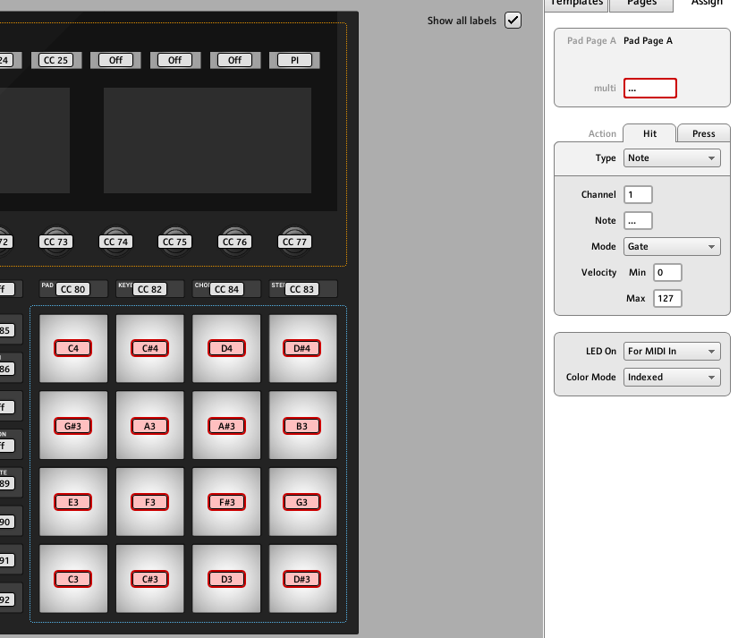
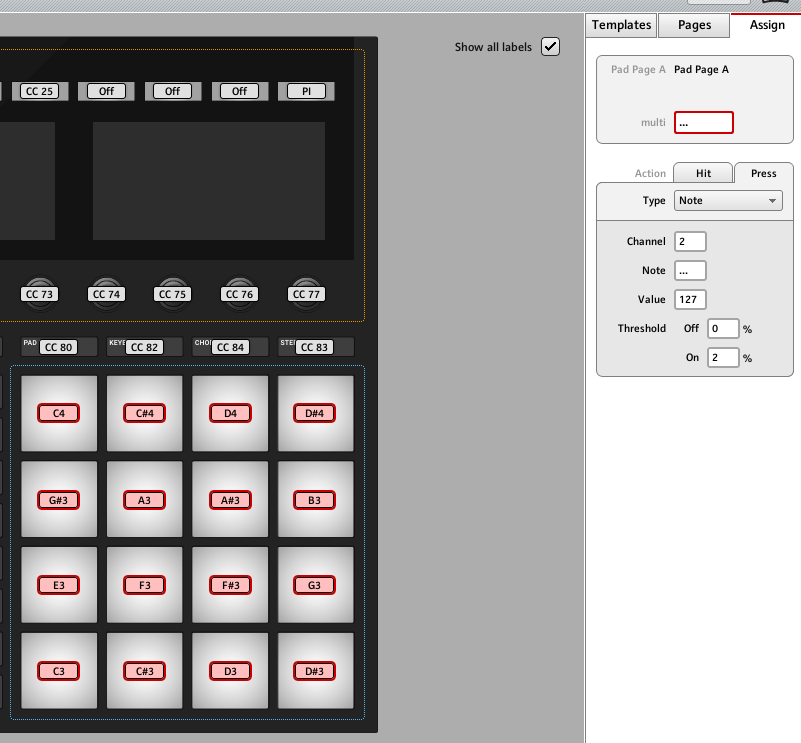
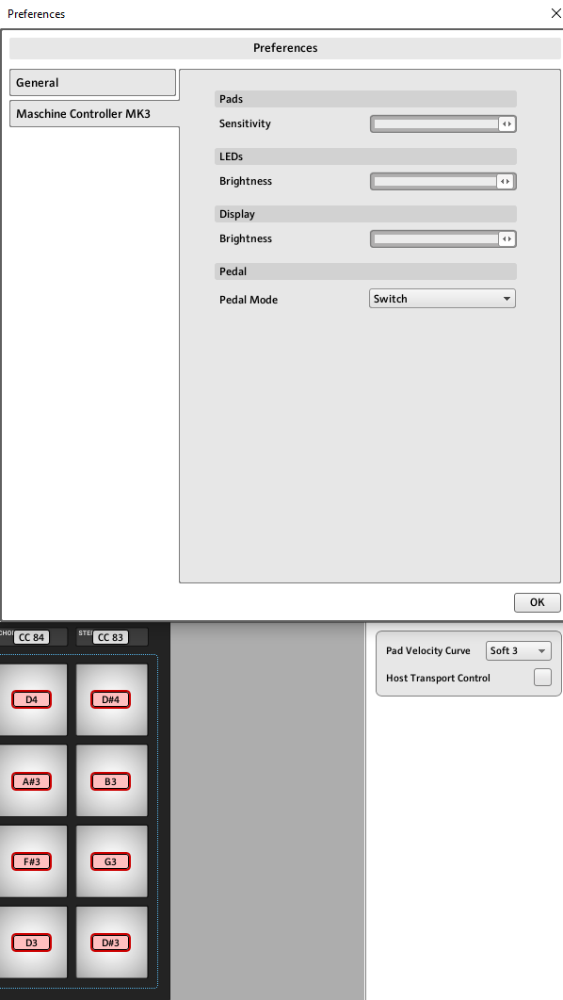
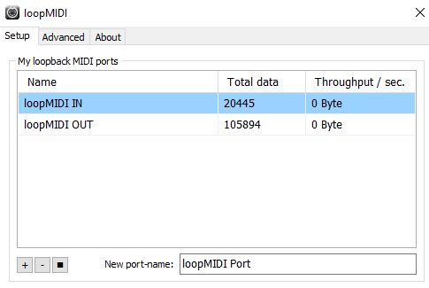

# 🎹 Melodics ⇄ Maschine MIDI Bridge

## Motivation

 Native Instruments Maschine — like many modern MIDI controllers — is designed to work seamlessly with its own software. However, when used with third-party applications like Melodics, users often notice that pad sensitivity and responsiveness degrade, especially when trying to play lightly or with expressive dynamics.

This is a well-known issue:
- Out of the native software environment, pad hits may feel less responsive, leading to missed hits, double triggers, or fatigue from needing to strike harder than necessary.

This script bridges that gap.

Inspired by classical piano techniques — especially those taught by Chopin, where touch and finger pressure are central — the goal of this bridge is to make your hand movement as minimal and expressive as possible, while ensuring reliable MIDI triggering and visual feedback from Melodics.
Why?

- ✅ Accurate response with soft playing — no need to smash the pads.

- ✅ Feedback lighting from Melodics to Maschine — as close as possible to native experience.

- ✅ More expressive performance — important in finger drumming and rhythm training.

By forwarding MIDI in a smart and filtered way, this bridge makes Maschine behave more like it does inside its native environment — while being fully functional with Melodics.

This script bridges MIDI communication between Native Instruments **Maschine MK3** and **Melodics**, allowing you to:

- Play pads on Maschine and trigger lessons in Melodics.
- Get visual pad feedback (lights) from Melodics back to Maschine.
- Auto-detect ports, optionally show debug output, and self-install dependencies.


## Disclaimer
- This project is not affiliated with or endorsed by Melodics.

## Links
- [Chopin method](https://www.youtube.com/watch?v=ctWUmDLATJw&embeds_referring_euri=https%3A%2F%2Ftonesharp.com%2F&source_ve_path=Mjg2NjY)
- [Blog post](https://tonesharp.com/blog/2025/05/31/finger-drumming-pad-hitting-techniques)
---

## NOTE
- for best result use .exe version

## RELEASES

- [MelodicsMashine v1.01 EXE app](https://github.com/VeselinovStf/Maschine-MIDI-Bridge/releases/tag/v1.0.1)

## NI Control Editor Settings

- pads must be set from C3 to D#4 notes



- For all pads! Hit must be set on Channel 1 



- For all pads! Press must be set on channel 2 with treshold of you liking 



- Tested with: Pad velocity curve Soft3 with Press threshold 2 and Pads Sensitivity to max!
  
## 📦 Requirements

- Fix: Install Microsoft C++ Build Tools
- You need to install the MSVC compiler, because your system currently has none of these:
    - icl
    - cl
    - g++
    - clang++

1. Install Build Tools

- Download from Microsoft: Microsoft Build Tools 2022 (search “Build Tools for Visual Studio 2022”)
- During installation, check these workloads:
    - ✔ Desktop development with C++
    - ✔ Under “Individual components”, add:
    - MSVC v143 toolset
    - Windows 10/11 SDK
    - CMake (optional but recommended)

This script uses:

- Python 3.7+
- `mido` – MIDI library for Python  
- `python-rtmidi` – MIDI backend
- loopMidi - for port forwarding
- Melodics configuration

## Install them manually:

- pip install mido python-rtmidi

## OR

- pip install -r requirements.txt

## Config
- The CLI version of script needs config.json as source of configuration
    - DEBOUNCE_MS setting for port note read time 
    - The configuration represents witch range of notes to redirect and for whitch ports to search
    - This way user can change port names and eaven use different controller!
  
```
{
    "DEBOUNCE_MS": 0.04,
    "NOTE_MIN": 48,
    "NOTE_MAX": 75,
    "patterns": {
        "maschine_in_port": "^Maschine MK3 Ctrl MIDI \\d+$",
        "melodics_in_port": "^loopMIDI IN \\d+$",
        "melodics_out_port": "^loopMIDI OUT \\d+$",
        "maschine_out_port": "^Maschine MK3 Ctrl MIDI \\d+$"
    }
}
```
## Run the script

- python melodics-maschine.py
- NOTE: If script is not detecting ports it will delay and try again

### To enable debug output:

- python melodics-maschine.py --debug
  
## 🧠 How It Works

- The script runs two threads:
    - Maschine → Melodics
        - Listens to pad hits from the physical Maschine MK3 Ctrl MIDI input and forwards valid notes to loopMIDI IN, which Melodics reads.
    - Melodics → Maschine
        - Listens to feedback from loopMIDI OUT and sends those messages to Maschine MK3 Ctrl MIDI output to light up pads.

    - The script only forwards MIDI NoteOn/NoteOff in the C3–D#4 range (MIDI 48–75), Channel 2 → Channel 1, and also handles control changes.
    - Note: mido ports are 0 base indexed
  
## 🎛️ Port Auto-Detection

- The script auto-detects ports using regular expressions:

```
Logical Name	Match Pattern	Direction
maschine_in_port	Maschine MK3 Ctrl MIDI \d+	MIDI IN
melodics_in_port	loopMIDI IN \d+	MIDI OUT
melodics_out_port	loopMIDI OUT \d+	MIDI IN
maschine_out_port	Maschine MK3 Ctrl MIDI \d+	MIDI OUT

```


## 🧪 Debug Mode ( CLI version )

- Use the --debug flag to see:
    - Detected MIDI ports
    - Each forwarded or filtered MIDI message

## 🛑 Exit  ( CLI version )

- Press Ctrl+C in your terminal to stop the bridge safely.

## 📝 Customization

- You can modify the following constants in the script ( CLI script uses config.json ):

```
NOTE_MIN = 48  # Lowest note (C3)
NOTE_MAX = 75  # Highest note (D#4)

```

## 💡 Tip: loopMIDI Setup



- Make sure loopMIDI is installed and you have created:
   - One loopMIDI IN port
   - One loopMIDI OUT port
- Melodics must be configured to:
   - Receive input from loopMIDI IN
   - Send output to loopMIDI OUT

## Background Tray App (.EXE Build for Windows)

- You can convert melodics-maschine-tray.py script into a Windows .exe app that:
    - Runs in the background
    - Hides the terminal window
    - Shows a system tray icon
    - Lets you right-click to exit
    - Detect if port is missing and shows message
    - Restart option - curently closes the app

### 📦 Additional Requirements

- To support the tray icon, install:
  
```
pip install pystray pillow
pip install pyinstaller

```

## Install Tray App

```
pip install -r requirements.txt
pyinstaller --noconsole --onefile .\melodics-maschine-tray.py --name=MelodicsMaschine_v1_01

```
- NOTE: config.js and requirements.txt must be in same directory where .exe is placed!

## Run at Start Up

- for Windows create Shortcut at: 

```
C:\Users\<USER_NAME>\AppData\Roaming\Microsoft\Windows\Start Menu\Programs\Startup
```

- Short cut must point to your created exe

## Melodics Setup

- Create Template at **or copy the file from config_files/virtual-midi-bus.json **

```
  C:\Users\<USER_NAME>\AppData\Local\Melodics\Melodics\devices
```
- Follow .rtf guidence
    - set in/out port to loop midi
- In App: Select User device under Settings 

## 🧰 Troubleshooting

- ❌ OSError: unknown port
- Make sure the loopMIDI or Maschine ports are created and visible before running the script.
- Swithing Device in Melodics may result with loopMidi muted channel - close the app, restart chanell 

## BUGS

- Turning of Maschine while Melodics is open and bringing back Maschine results in not forwarding light to Maschine
- Some times changing device in Melodics may result in muted port in loopMidi

## 🔄 Port Numbers Keep Changing?

- No problem — the script matches ports by name pattern, not number.

## © License

MIT – Use freely, credit appreciated.